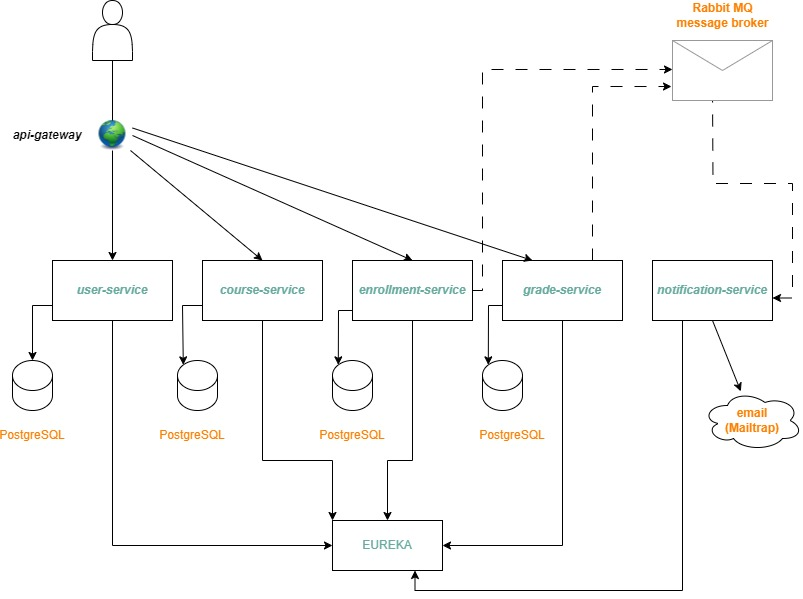

Ovaj projekat sastoji se od ukupno 7 mikroservisnih komponenti, od kojih 5 predstavlja cjelokupnu biznis logiku, zajedno sa 2 dodatna servisa: *api-gateway* (ulazna tačka, zadužen za rutiranje zahtjeva i autorizaciju istih) i *Eureka*.
## Opis poslovne logike 
- **user-service** : Ovaj mikroservis zadužen je za upravljanje korisnicima. To upravljanje podrazumjeva registraciju novih korisnika i njihovo logovanje (metode *login* i *register*), te operacije koje je moguće izvoditi nad postojećim korisnicima (npr. ažuriranje i brisanje postojećih korisnika) i operacije koje služe za dostavljanje podataka drugim mikroservisima u ovom sistemu (posebni *endpoint*-i koji se gađaju od strane drugih mikroservisa u sistemu putem *FeignClient*-a). U okviru ovog servisa odrađena je zasebna autorizacija koja se tiče pristupa konkretno metodama koje su u okviru njega izložene. 
- **course-service** : Ovaj mikroservis služi kao evidencija kurseva koji se nalaze u opticaju za pohađanje i polaganje. Slično kao i servis namjenjen korisnicima, podržava osnovne CRUD operacije koje se tiču dodavanja novih kurseva, te ažuriranja i brisanja postojećih. Metode koje ne bi trebao da vidi svaki korisnik su posebno autorizovane. Takođe, ovaj servis i njegove metode se pozivaju od strane drugih servisa, stoga i u njima postoje *endpoint*-i namjenjeni za internu komunikaciju.
- **enrollment-service** : Ovaj mikroservis namjenjen je evidenciji upisa na kurseve, tačnije služi kao spona između studenata koji postoje u sistemu i kurseva koji pohađaju. Takođe, u okviru ovog sistema čuvaju se i prijave za svaki od studenata i kurseva. Prijave i upisi na kurs su odvojeni entiteti. Student, da bi se upisao na kurs, prvo podnosi prijavu i čeka na njeno odobravanje, a ako je prijava odobren (za šta se provjeravaju određeni uslovi, kao što je broj ostvarenih poena na prijemnom ispitu (svaki kurs ima minimalan broj poena koji je neophodan za upis), rok prijave, dosadašnji broj polaganja istog kursa od strane istog studenta (svaki student ima pravo dva puta da polaže isti kurs) i tome slično) student se naknadno upisuje na kurs. Metode koje ne treba da vidi običan korisnik-student su posebno autorizovane. Nakon što se student uspješno upiše na kurs, šalje se notifikacija o uspješnom upisu na *rabbit-mq exchange*, koju dalje obrađuje *notification-service* i šalje mejl kao obavještenje studentu da je uspješno upisan. Ova komunikacija je **asinhrona**. Nakon što se uspješno upiše, obzirom da postoji mogućnost pohađanja više kurseva istovremeno, student može na osnovu svog identifikatora da pogleda sve kurseve na kojima je upisan. Admin i profesor imaju mogućnost pregledanja ko od studenata je upisan na neki kurs.
- **grade-service** : Ovaj mikroservis predstavlja jednu verziju elektronskog dnevnika. Naime, ocjene koje su dodjeljene nekom studentu za ostvareni uspjeh na nekom kursu, evidentirane (i upravljane) su u okviru ovog servisa. Svaka ocjena se vezuje za određeni upis, na osnovu kog se zna kom studentu je dodjeljena ocjena i za pohađanje kog kursa. Prema ostvarenom broju poena, na skali 0-100 studentu se dodjeljuje ocjena i status njegovog upisa se mjenja shodno toj ocjeni (položio ili nije položio). Ovaj servis koristi se u internoj komunikaciji, stoga postoje i *endpoint*-i namjenjeni istoj. Nakon što student dobije ocjenu, šalje se notifikacija o istoj na rabbit-mq exchange, a tu poruku dalje obrađuje *notification-service* i šalje mejl studentu u kom ga obavještava da može da provjeri svoju ocjenu. Ova komunikacija je **asinhrona**.
- **notification-service** : Ovaj servis, tehnički gledano, predstavlja zasebnu cijelinu u odnosu na ostale servise, međutim logički je ipak usko povezan sa njima, jer se njegov rad i logika zasnivaju na aktivnostima koje se odvijaju u drugim servisima. Preciznije, ovaj servis koristi *rabbit-mq* biblioteku kako bi se pretplatio na određeni *exchange* i osluškivao dolazeće poruke. Kada dobije notifikaciju da je neka poruka objavljena (pod tom porukom podrazumjeva se ili obavještenje da je student uspješno upisan na kurs za koji se prijavio ili da mu je dodjeljena ocjena za neki kurs), u tom trenutku nakon stizanja notifikacije, ovaj servis šalje mejl na adresu koju je dobio iz same notifikacije, kojom se obavještava student o stanju svoje prijave ili ocjene.
Dodatni servisi:
- **api-gateway** : Namjena ovog servisa je da bude ulazna tačka u sam sistem, odnosno jedna vrsta preusmjerivača dolazećih zahtjeva, koji se potom rutiraju (u skladu sa pravima pristupa) ka prethodno opisanim servisima. Podržava autorizaciju putem JWT, pri čemu je implementiran filter koji služi za ekstrahovanje dolazećih tokena i dodjeljivanje prava pristupa, te posebna sigurnosna konfiguracija koja definiše ko ima kakva prava pristupa. U sistemu su evidentirane 3 različite uloge: student, proesor i admin. Adminu su dozvoljene sve metode, profesoru većina, a student ima mogućnost uglavnom pregleda podataka, te prijave i upisa na kurs. Takođe, profesore u sistem dodaje admin, za šta postoji posebna metoda u okviru servisa za upravljanje korisnicima.
- **eureka** :Ovaj mikroservis služi za otkrivanje i registrovanje servisa, razvijen od strane *Netflix*-a, a često korišćen u sklopu *Spring Cloud* ekosistema. Omogućava automatsko registrovanje sistema kada se pokrenu, kao i međusobni pronalazak, bez potrebe za ručnim podešavanjem IP adresa ili portova.

#### Detalji implementacije:
- Autorizacija je rađena pomoću *json web token*-a, na način da postoji *security-config*, u kom se definiše koje rute su kome namjenjene, te  *jwt authentication filter*, koji se bavi presretanjem zahtjeva i provjeravanjem tokena (ako postoji) i shodno tome dodjeljivanjem pristupa. User-service, obzirom da upravlja logovanjem i registracijom korisnika, ima posebnu autorizaciju, koja utiče na definisanje prava pristupa metodama ovog servisa.
- Za internu komunikaciju koristi se *FeignClient*, pri čemu se svaki od potrebnih servisa injektuje kao zavisnost. Obzirom da ovi servisi međusobno komuniciraju putem *ednpoint*-a, njih je takođe bilo potrebno zaštiti. Ove metode u okviru svojih putanja imaju *intern* oznaku, radi lakšeg internog prepoznavanja i ograničavanja pristupa. Prava pristupa definisana su upotrebom *X-Service-Auth* zaglavlja, koje servisi šalju zajedno sa svojim zahtjevom, a servis čiji *endpoint*-i su korišćeni od strane drugih servisa ima *interceptor* koji se bavi provjeravanjem ovih zaglavlja. Za sve servise koristi se jedinstven (dijeljen) *security key* koji se šalje u zaglavlju, a čuva u konfiguraciji svakog od servisa.
- Slanje notifikacija obavlja se upotrebom *RabbitMq* biblioteke, pri čemu se podiže testni *RabbitMq* na koji se šalju poruke od strane servisa za upis i servisa za ocjenjivanje, a koji osluškuje servis za notifikacije, a potom šalje mejl studentu kome je ocjena dodjeljena. Za slanje mejla u svrhu testiranja iskorišćen je *Mailtrap*.
- Za skladištenje podataka korišćena je baza *PostgreSQL*.

### Dijagram mikroservisnog sistema

## CI/CD Pipeline

*GitHub Actions pipeline* automatski pokreće *build* i *test* proces na svakom *push*-u na granama *main* i *develop*:

Glavne faze:
- **Build** (Kompajliranje/Dockerizacija): Automatski build svih servisa koristeći *Maven* i *Docker*.
- **Test** (*Unit*, *Integration* i ostali testovi): Na main grani pokreće sve testove, a u fazi razvoja preskače.
- **Docker integracija**: Koristi *docker-compose* za pokretanje servisa.
- **Healthcheck**: Provjerava da li su svi servisi uspješno pokrenuti.

### Tehnologije:
- *GitHub Actions*
- *Java 17*
- *Docker*/*Docker Compose*
- *Maven*

### Pokretanje:
Pipeline se automatski pokreće na:
- Push na `main` (sa testovima)
- Push na `develop` (bez testova)
